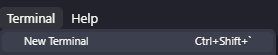

# Hướng Dẫn Cài Đặt Frontend (EduPath)

Tài liệu này hướng dẫn cách thiết lập và chạy dự án Frontend EduPath ở môi trường local.

## Công cụ yêu cầu

Trước khi bắt đầu, hãy đảm bảo máy tính của bạn đã cài đặt các công cụ sau:

- **Visual Studio Code** (hoặc một IDE code bất kỳ)
- **Node.js** (Khuyến nghị bản LTS) -> [Tải Node.js tại đây](https://nodejs.org/en/download)

---

## Các bước tiến hành

### **Bước 1: Mở dự án**

Mở thư mục dự án **EduPath**, truy cập sâu vào thư mục gốc tên là `edupath-frontend-1`.

### **Bước 2: Mở Terminal**

Mở một cửa sổ Terminal (với đường dẫn đang đứng tại thư mục `edupath-frontend-1` vừa mở).


### **Bước 3: Cài đặt các thư viện phụ thuộc (Dependencies)**

Tại cửa sổ Terminal, gõ lệnh sau và nhấn `Enter`:

```bash
npm install
```

Sau khi cài đặt xong các thư viện, gõ lệnh sau và nhấn `Enter`

```bash
npm run dev
```
